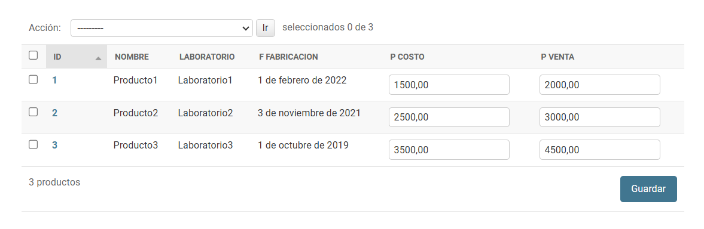

# EjercicioFinalLaboratorioV2
Educativo y de Aprendizaje Personal
---
## Tabla de Contenidos
- [Requisitos](#requisitos)
- [Configuración del Entorno](#configuración-del-entorno)
- [Activación del Entorno](#Activación-del-Entorno)
- [Configuración Inicial](#configuración-inicial)
- [Pasos del Proyecto](#pasos-del-proyecto)
- [Configuración Base de datos](#configuración-Base-de-datos)
  - [Creación del Modelo ](#creación-del-modelo)
  - [Creamos el superusuario](#creamos-el-superusuario)
  - [Parte 2](#parte-2)
  - [Parte 3](#parte-3)
  - [Parte 4](#parte-4)
---

## Requisitos
- Django 4.0 o superior
---

## Configuración del Entorno

1. Crear el entorno virtual:
   ```bash
   python -m venv venv


## Activación del Entorno

2. Activar el entorno virtual:
    ### Windows
    ```bash
    venv\Scripts\activate

## Configuración Inicial
## Instalar Django y Guardar dependencias

3. Intalación Django y pyscopg2
    ```bash
    pip install django==4.1.1 psycopg2

4. Instalamos la actualizacion de pip
    ```bash
    python.exe -m pip install --upgrade pip

## Guardar las dependencias
5. Instalación dependencias
    ```bash
   pip freeze > requirements.txt

## Pasos del Proyecto

6. Crear el Proyecto
    ```bash
    cd config
    django-admin startproject practica_final_orm_django

7. Ingresar al directorio del Proyecto
    ```bash
    cd practica_final_orm_django

8. Creamos la Aplicación laboratorio 
    ```bash
   python manage.py startapp laboratorio

9. Conectar el proyecto con la aplicación: Agregar 'laboratorio' en la lista INSTALLED_APPS dentro del archivo config/practica_final_orm_django/settings.py

    ```bash
    INSTALLED_APPS = [
    'django.contrib.admin',
    'django.contrib.auth',
    'django.contrib.contenttypes',
    'django.contrib.sessions',
    'django.contrib.messages',
    'django.contrib.staticfiles',
    'laboratorio',
    ]
# Configuración Base de datos
10. Instalar python-decouple: Es una biblioteca que ayuda manejar las variables de entorno 
    ```bash
    pip install python-decouple

11. Creamos el archivo .env a la altura del proyecto al lado manage.py 
    ```bash
    DATABASE_NAME=db_final_orm
    DATABASE_USER=postgres
    DATABASE_PASSWORD=yourpassword
    DATABASE_HOST=localhost
    DATABASE_PORT=5432

12. Configuracion de la base de datos ingresando los parametros de conexión 
    ```bash
    from decouple import config

    DATABASES = {
        'default': {
            'ENGINE': 'django.db.backends.postgresql',
            'NAME': config('DATABASE_NAME'),
            'USER': config('DATABASE_USER'),
            'PASSWORD': config('DATABASE_PASSWORD'),
            'HOST': config('DATABASE_HOST'),
            'PORT': config('DATABASE_PORT'),
        }
    }
13. Guardamos dependencias
    ```bash
    cd ..
    cd ..
    pip freeze > requirements.txt

# Creación del Modelo 

14. en config/practica_final_orm_laboratorio/laboratoio/models.py
    ```bash
    from django.db import models
    from django.core.exceptions import ValidationError
    from datetime import date

    class Laboratorio(models.Model):
        nombre = models.CharField(max_length=255)

        def __str__(self):
            return self.nombre

    class DirectorGeneral(models.Model):
        nombre = models.CharField(max_length=255)
        laboratorio = models.OneToOneField(Laboratorio, on_delete=models.CASCADE)

        def __str__(self):
            return self.nombre

    class Producto(models.Model):
        nombre = models.CharField(max_length=255)
        laboratorio = models.ForeignKey('Laboratorio', on_delete=models.CASCADE)
        f_fabricacion = models.DateField(null=True, blank=True)  
        p_costo = models.DecimalField(max_digits=12, decimal_places=2)
        p_venta = models.DecimalField(max_digits=12, decimal_places=2)

        def clean(self):
            if self.f_fabricacion:  # Validar solo si f_fabricacion no es None
                if self.f_fabricacion < date(2015, 1, 1):
                    raise ValidationError("La fecha de fabricación no puede ser anterior a 2015.")

        def __str__(self):
            return self.nombre


15. Aplicar Migraciones 
    ```bash
    python manage.py makemigrations laboratorio
    python manage.py migrate

# Creamos el superusuario
16. Creamos el administrador de la base de datos
    ```bash	
    python manage.py createsuperuser

17. Se Crea un contraseña solo para fines pedagogicos y para ir testeando el modelo
    ```bash	
    admin
    admin@gmail.com
    admin1234
    y
18. config/practica_final_orm_django/laboratorio/admin.py
    ```bash
    from django.contrib import admin
    from .models import Laboratorio, DirectorGeneral, Producto

    # Register your models here.
    admin.site.register(Laboratorio)
    admin.site.register(DirectorGeneral)
    admin.site.register(Producto)

19. Nos Vamos a la pagina 127.0.0.1:8000/admin
    ```bash
    python manage.py runserver

## Parte 2 
20. Adecue el sitio administrativo de Django agregando los modelos Laboratorio, director general,
y Productos, para que se muestre de la siguiente manera:
<p align="center">
  
</p>

21. Adecue la interfaz administrativa con la finalidad de que se observe de la siguiente manera, y
agregue los siguientes Laboratorios:

<p align="center">
  
</p>

22. Adecue la interfaz administrativa con la finalidad de que se observe de la siguiente manera, y
agregue por medio de la interfaz administrativa, los siguientes directores generales:

<p align="center">
  
</p>

23. Adecue la interfaz administrativa con la finalidad de que se observe de la siguiente manera, y
agregue por medio de la interfaz administrativa, los siguientes Productos:

<p align="center">
  
</p>

24. Por medio de la consola interpretador de python (shell), realice las siguientes consultas:
    ```bash
    python manage.py shell

25. Importar los modelos
    ```bash
    from laboratorio.models import Laboratorio, DirectorGeneral, Producto

26. Realizar las consultas Consulta 1: Obtener todos los objetos de Laboratorio, DirectorGeneral, y Producto (Eliminar los espacios a los lados)
    ```bash
    # Todos los objetos de Laboratorio
    laboratorios = Laboratorio.objects.all()
    print("Laboratorios:", laboratorios)

    # Todos los objetos de DirectorGeneral
    directores = DirectorGeneral.objects.all()
    print("Directores Generales:", directores)

    # Todos los objetos de Producto
    productos = Producto.objects.all()
    print("Productos:", productos)


27. Consulta 2: Obtener el laboratorio del Producto cuyo nombre es ‘Producto 1’
    ```bash
    producto = Producto.objects.get(nombre='Producto1') 
    laboratorio = producto.laboratorio  
    print("Laboratorio de Producto 1:", laboratorio)

28. Consulta 3: Ordenar todos los productos por nombre y mostrar nombre y laboratorio
    ```bash
    productos_ordenados = Producto.objects.order_by('nombre') 
        for producto in productos_ordenados:
            print(f"Nombre: {producto.nombre}, Laboratorio: {producto.laboratorio}")

29. Consulta 4: Mostrar los laboratorios de todos los productos
    ```bash
    productos = Producto.objects.all()  
        for producto in productos:
            print(f"Producto: {producto.nombre}, Laboratorio: {producto.laboratorio}")

## Parte 3

30. Realice las siguientes modificaciones al modelo, agregando los siguientes campos:
    La nueva migración se llamará actualizado_campos.
    ● Laboratorio:
    ○ ciudad: cadena de caracteres.
    ○ pais: cadena de caracteres.
    ● DirectorGeneral:
    ○ especialidad: cadena de caracteres.
    Muestre todas las migraciones realizadas.

    ```bash
    # En laboratorio/models.py

    from django.db import models
    from django.core.exceptions import ValidationError
    from datetime import date

    class Laboratorio(models.Model):
    nombre = models.CharField(max_length=255)
    ciudad = models.CharField(max_length=255, null=True, blank=True)  # Valor por defecto
    pais = models.CharField(max_length=255, null=True, blank=True)   # Valor por defecto

    def __str__(self):
        return self.nombre


    class DirectorGeneral(models.Model):
        nombre = models.CharField(max_length=255)
        laboratorio = models.OneToOneField(Laboratorio, on_delete=models.CASCADE)
        especialidad = models.CharField(max_length=255, null=True, blank=True, default="General")  # Valor por defecto

        def __str__(self):
            return self.nombre


    class Producto(models.Model):
        nombre = models.CharField(max_length=255)
        laboratorio = models.ForeignKey(Laboratorio, on_delete=models.CASCADE)
        f_fabricacion = models.DateField(null=True, blank=True, default=date(2023, 1, 1))  # Fecha por defecto
        p_costo = models.DecimalField(max_digits=12, decimal_places=2, default=0.00)  # Valor por defecto
        p_venta = models.DecimalField(max_digits=12, decimal_places=2, default=0.00)  # Valor por defecto

        def clean(self):
            if self.f_fabricacion:
                if self.f_fabricacion < date(2015, 1, 1):
                    raise ValidationError("La fecha de fabricación no puede ser anterior a 2015.")

        def __str__(self):
            return self.nombre

31. Crea la migracion
    ```bash
    python manage.py makemigrations 

32. Aplicamos la migraciòn
    ```bash
    python manage.py migrate

## Parte 4
33. Se Crea el formulario laboratorio/forms.py
     ```bash
    from django import forms
    from .models import Laboratorio

    class LaboratorioForm(forms.ModelForm):
        class Meta:
            model = Laboratorio
            fields = ['nombre', 'ciudad', 'pais']
            widgets = {
                'nombre': forms.TextInput(attrs={
                    'placeholder': 'Ingrese el nombre del laboratorio',
                    'class': 'form-control',
                }),
                'ciudad': forms.TextInput(attrs={
                    'placeholder': 'Ingrese la ciudad',
                    'class': 'form-control',
                }),
                'pais': forms.TextInput(attrs={
                    'placeholder': 'Ingrese el país',
                    'class': 'form-control',
                }),
            }


34. Creamos las vistas laboratorio/views.py
    ```bash
    from django.shortcuts import render, get_object_or_404, redirect
    from .models import Laboratorio
    from .forms import LaboratorioForm
    from django.core.paginator import Paginator
    from django.db.models import IntegerField
    from django.db.models.functions import Cast, Substr

    # 1. Listar laboratorios
    def laboratorio_list(request):
        # Obtener el contador de visitas de las cookies del usuario
        visitas = int(request.COOKIES.get('visitas', 0)) + 1

        # Anotar el número extraído y ordenar por este valor
        laboratorios = Laboratorio.objects.annotate(
            numero=Cast(Substr('nombre', 12), IntegerField())
        ).order_by('numero')

        # Implementar paginación (10 elementos por página)
        paginator = Paginator(laboratorios, 5)
        page_number = request.GET.get('page')  # Obtener el número de página desde la URL
        page_obj = paginator.get_page(page_number)

        # Renderizar la página
        response = render(request, 'laboratorios/laboratorio_list.html', {
            'page_obj': page_obj,
            'visitas': visitas,
        })

        # Configurar la cookie de visitas
        response.set_cookie('visitas', visitas, max_age=60*60*24*30)  # 30 días de duración

        return response

    # 2. Crear un nuevo laboratorio
    def laboratorio_create(request):
        if request.method == 'POST':
            form = LaboratorioForm(request.POST)
            if form.is_valid():
                form.save()
                return redirect('laboratorio_list')
        else:
            form = LaboratorioForm()
        return render(request, 'laboratorios/laboratorio_form.html', {'form': form})

    # 3. Ver detalles de un laboratorio
    def laboratorio_detail(request, pk):
        laboratorio = get_object_or_404(Laboratorio, pk=pk)
        return render(request, 'laboratorios/laboratorio_detail.html', {'laboratorio': laboratorio})

    # 4. Actualizar un laboratorio
    def laboratorio_update(request, pk):
        laboratorio = get_object_or_404(Laboratorio, pk=pk)
        if request.method == 'POST':
            form = LaboratorioForm(request.POST, instance=laboratorio)
            if form.is_valid():
                form.save()
                return redirect('laboratorio_list')
        else:
            form = LaboratorioForm(instance=laboratorio)
        return render(request, 'laboratorios/laboratorio_form.html', {'form': form})

    # 5. Eliminar un laboratorio
    def laboratorio_delete(request, pk):
        laboratorio = get_object_or_404(Laboratorio, pk=pk)
        if request.method == 'POST':
            laboratorio.delete()
            return redirect('laboratorio_list')
        return render(request, 'laboratorios/laboratorio_confirm_delete.html', {'laboratorio': laboratorio})

35. Configurar la Url del Proyecto config/practica_final_orm_django/practica_final_orm_django/urls.py
    ```bash
    from django.contrib import admin
    from django.urls import path, include

    urlpatterns = [
        path('admin/', admin.site.urls),
        path('', include('laboratorio.urls')), 
    ]

36. Crea laboratorio/urls.py
    ```bash
    from django.urls import path
    from . import views

    urlpatterns = [
        path('', views.laboratorio_list, name='laboratorio_list'),
        path('laboratorios/nuevo/', views.laboratorio_create, name='laboratorio_create'),
        path('laboratorios/<int:pk>/', views.laboratorio_detail, name='laboratorio_detail'),
        path('laboratorios/<int:pk>/editar/', views.laboratorio_update, name='laboratorio_update'),
        path('laboratorios/<int:pk>/eliminar/', views.laboratorio_delete, name='laboratorio_delete'),
    ]

37. Creamos los templates/laboratorio_list.html
    ```bash
    
    <!DOCTYPE html>
    <html lang="en">

    <head>
        <meta charset="UTF-8">
        <meta name="viewport" content="width=device-width, initial-scale=1.0">
        <link rel="stylesheet" href="">
        <title>Lista de Laboratorios</title>
    </head>

    <h1>Información de Laboratorios</h1>
    <a href="" class="action-link">Crear Nuevo Laboratorio</a>
    <table>
        <thead>
            <tr>
                <th>Nombre</th>
                <th>Ciudad</th>
                <th>País</th>
                <th>Editar</th>
                <th>Eliminar</th>
            </tr>
        </thead>
        <tbody>
            
            <tr>
                <td>{{ laboratorio.nombre }}</td>
                <td>{{ laboratorio.ciudad }}</td>
                <td>{{ laboratorio.pais }}</td>
                <td><a href="" class="action-link">Actualizar</a></td>
                <td><a href="" class="action-link delete">Eliminar</a></td>
            </tr>
            
        </tbody>
    </table>

    <div class="footer">
        <p>¿Información de los Laboratorios?</p>
        <a href="#">Ir a la página de inicio</a>
        <p>Usted ha visitado esta página {{ visitas }} veces.</p>
    </div>
    </body>

    </html>

38. Creamos los templates/laboratorio_form.html
    ```bash
    
    <!DOCTYPE html>
    <html lang="en">

    <head>
        <meta charset="UTF-8">
        <meta name="viewport" content="width=device-width, initial-scale=1.0">
        <link rel="stylesheet" href="">
        <title>Editar LaboratorioCrear Laboratorio</title>
    </head>

    <body>
        <h1>Editar LaboratorioCrear Laboratorio</h1>
        <form method="post">
            
            {{ form.as_p }}
            <button type="submit">Guardar</button>
            <a href="">Cancelar</a>
        </form>
    </body>

    </html>
39. templates/laboratorio_detail.html
    ```bash
    <h1>Detalles del Laboratorio</h1>
    <p><strong>Nombre:</strong> {{ laboratorio.nombre }}</p>
    <p><strong>Ciudad:</strong> {{ laboratorio.ciudad }}</p>
    <p><strong>País:</strong> {{ laboratorio.pais }}</p>
    <a href="">Volver</a>

40. templates/laboratorio_confirm_delete.html
    ```bash
    <h1>¿Está seguro de que desea eliminar este laboratorio?</h1>
    <p><strong>Nombre:</strong> {{ laboratorio.nombre }}</p>
    <p><strong>Ciudad:</strong> {{ laboratorio.ciudad }}</p>
    <p><strong>País:</strong> {{ laboratorio.pais }}</p>
    <form method="post">
        
        <button type="submit">Eliminar</button>
        <a href="">Cancelar</a>
    </form>

41. Vamos a la página principal http://127.0.0.1:8000/ podemos crear, actualizar y eliminar datos
    ```bash
    python manage.py runserver 